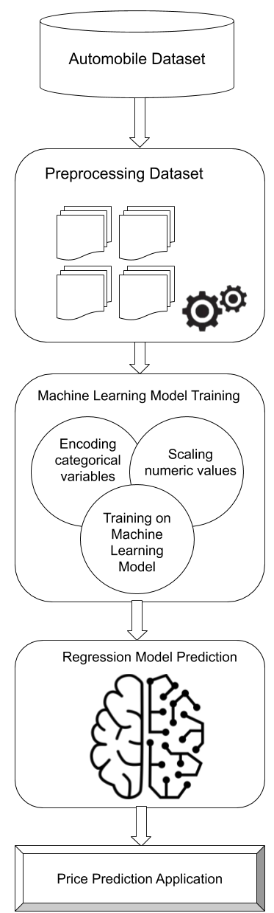

# Data-Analysis-of-Indian-Automobile-dataset-using-Machine-Learning-in-R

#### The project aims to perform various visualizations and provide various insights from the considered Indian automobile dataset by performing data analysis that utilizing machine learning algorithms in R programming language. The considered dataset is of Indian cars that consists of various features such as model, manufacturer, year, transmission, engine, power etc. The insights that could be estimated from this dataset would be feature such as price of a specific car model that could be estimated using the other attributes of that particular car model using machine learning algorithms like Linear Regression

 

### 🖥️ Technologies and Tools used

 

## ABSTRACT

The automobile industry today is the most profitable industry. Due to increase in the income in both rural and urban sector and availability of easy finance are the main drivers of highvolume car segments. The objective of this project is to visualize and provide various insights from the considered Indian automobile dataset by performing data analysis that utilizing machine learning algorithms in R programming language. The considered dataset is of Indian cars that consists of various features such as model, manufacturer, year, transmission, engine, power etc. The insights that could be estimated from this dataset would be feature such as price of a specific car model that could be estimated using the other attributes of that particular car model using machine learning algorithms like Linear Regression. The objective also includes the study of various attributes of the considered Indian automobile dataset and finding the relationship or statistically, finding the correlation between them and visualizing the findings. The result of finding this relationship between various attributes of a vehicle will provide useful insights in building in a prediction model capable of predicting the price of a vehicle based on the other attributes. This kind of an analytics will help the consumers to decide the selling price of a vehicle without rough estimates which sometimes may underestimate the price of vehicles leading to loss of customer automobile value. Thus, this kind of analytics will certainly have a practical industry use case which might be useful to create end products to consumers which are capable of providing insights of various attributes of automobiles and also to look into analytics and knowing the segment of automobiles that are successful in the market.

 

## PROPOSED METHODLOGY

The architecture of the entire project is divided into two parts which are the visualization and the data analysis parts of the project. The visualization part of the project deals with the various plotting of attributes while the data analysis part of the project deals with finding the relationship between various attributes in the dataset.  
First the dataset if taken into preprocessing where the data is cleaned of missing and nan values. Also, the data imputation takes place in this step. The dataset consists of many missing values and some required attributed that were false recorded as zero values like mileage which can only be a non-zero value. Since the rows that consisted missing values only amount to less than one percent of the data, rows with missing values are deleted and some rows with zero values are imputed with the mode of that particular attribute.  
The visualization part consists of univariate analysis, analyzing the data in perspective of a single attribute then with bivariate analysis, analysis using two attributes and then with multivariate which deals with more than two attributes at the same time. Here the attribute’s distributions are visualized using count plots, barplots, histograms, etc. The bivariate analysis is done using scatter plots, box plots, violin plots and so on. Similar plots are used in multivariate analysis but the third or more dimensions are represented on two dimensions by adding colors or size to the plot attributes.  
The data analysis is performed on the automobile dataset utilizing machine learning algorithms in order to study the various relationships between attributes of the considered Indian automobile dataset and attempts to consolidate the findings of the relationship between the attributes or statistically, finding the correlation between them and visualizing the findings. Of these features some of them might be a redundant and might be a good contributor to the prediction model and the task of eliminating such attributes also shall be considered. The result of finding this relationship between various attributes of a vehicle will provide useful insights in building in a prediction model capable of predicting the price of a vehicle based on the other parameters like manufacturer, year, horsepower and so on.

 
 

## VISUALIZATIONS

